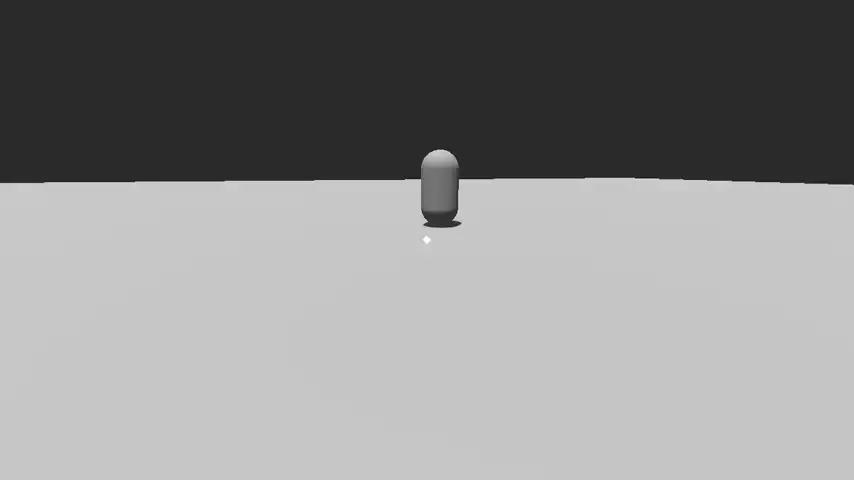

# net.bobbo.control-projection

A Godot plugin made for BOBBO-NET's netengine5 framework.
This plugin provides a set of Control nodes that allow you to anchor 2D UI elements over objects in-game.

## Dependencies

This plugin is made for Godot 4.1.

## Usage

### BasicProjection

The BasicProjection node projects a Control into 3D space, following an assigned target. It's basic because that's all it does. When the object is off screen, the control is hidden. The control does not scale to distance. Plain, simple, useful.

### StickyProjection

The StickyProjection node projects a Control into 3D space, following an assigned target, but sticks to the edges of the screen. When the target is offscreen, the node will stay within a margin of the screen edges to indicate the general direction of the target.

### DistanceFillProjection

The DistanceFillProjection node projects a Control into 3D space, following an assigned target, but switches between screen space and world space depending on how far the target is from the camera.
