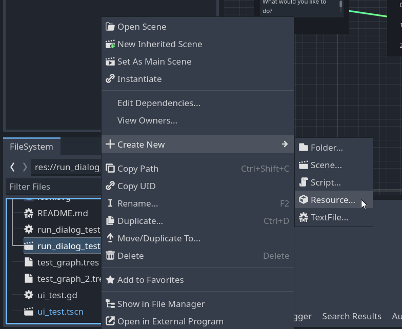
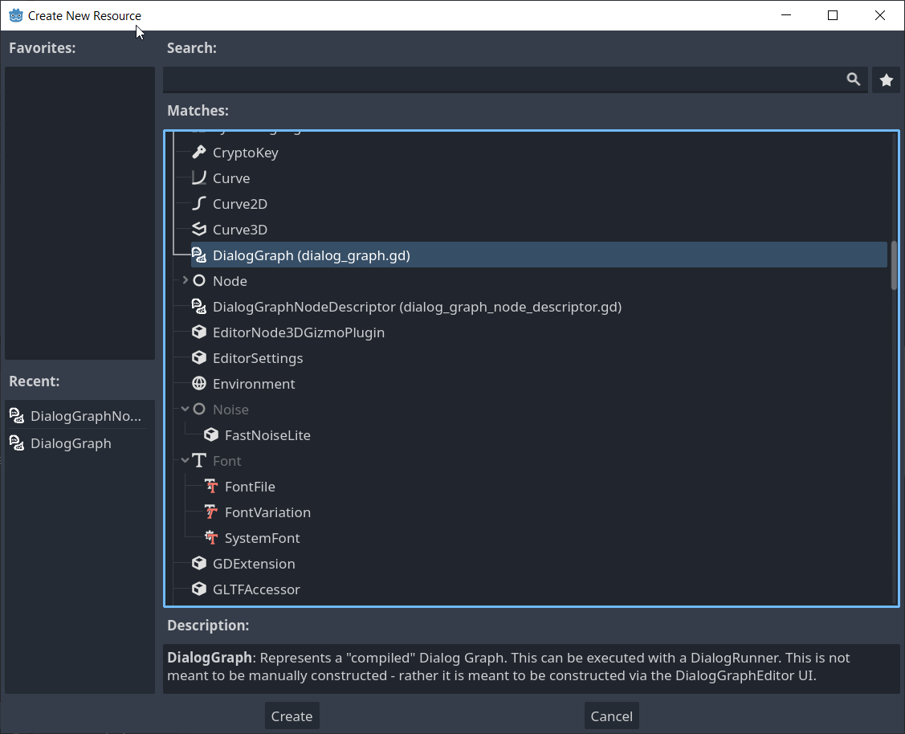
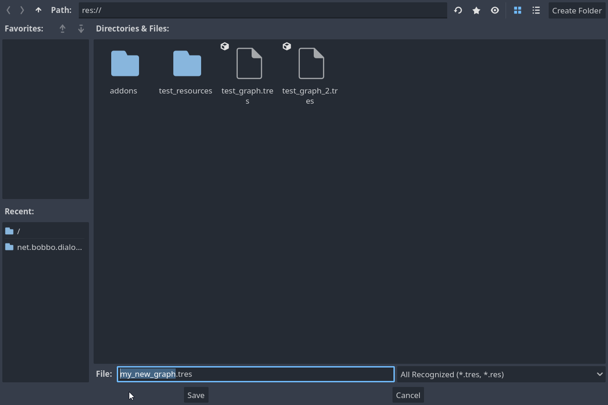
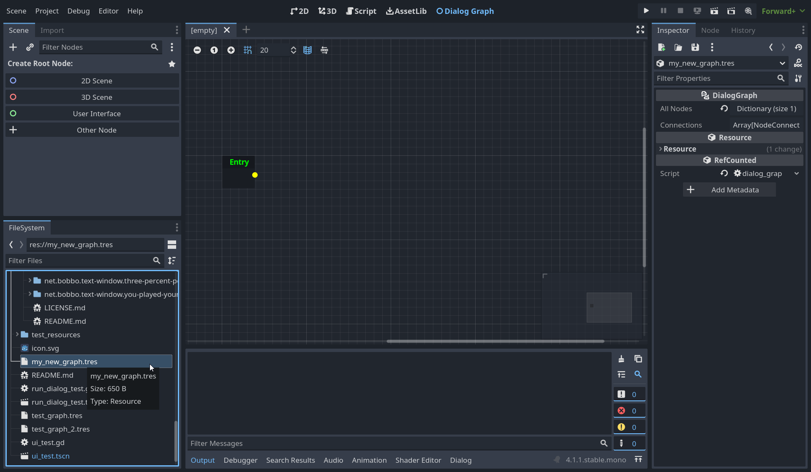

# net.bobbo.dialog-graph

A Godot plugin made for BOBBO-NET's netengine5 framework.
This plugin provides Dialog Graphs - which store the state of some branching executable dialog tree.

## Dependencies

This plugin is made for Godot 4.1. The following plugins must be installed:

- `net.bobbo.character`
- `net.bobbo.knowledge`
- `net.bobbo.resource-field`
- `net.bobbo.state-machine`
- `net.bobbo.text-reader`
- `net.bobbo.text-window`

## Usage

### Creating a `DialogGraph`

New `DialogGraph`s can be created using Godot's New Resource menu.

1. Right click in the Godot filesystem and create a new resource. 
2. Select the `DialogGraph` type. 
3. Name the new graph appropriately. 
4. Double click on the new graph file to open it in the Dialog Graph editor. 

### Editing a `DialogGraph`

#### Controls

Once a the `DialogGraph` editor is open, you can perform the following.

- Press and hold the middle mouse button to move around the graph
- Right click and select an option to spawn a new Dialog Node
- Connect nodes together by clicking and dragging on a node's output to another node's input
- Spawn a new node by clicking and dragging on a node's output to an empty space in the graph
- Box-select nodes by clicking on an empty space in the graph and dragging over each node you want to select
- Delete a node by clicking it's X button, or selecting it and pressing delete
- Save by pressing `CTRL` + `S`

#### Entry Node

Every `DialogGraph` always has an Entry node that can not be deleted or manually spawned. It is always the node that the `DialogRunner` starts executing the graph from, if no other node is specified. That means - typically this is always the starting point of the graph!

### Executing a `DialogGraph`

`DialogGraph`s can be executed through the use of the `DialogRunner` node. A preset scene that uses this node can be found at `addons/netengine5/net.bobbo.dialog-graph/dialog_runner/dialog_runner.tscn`. Don't forget to populate it's `text_window` field!

### Creating a new type of Dialog Node

Types of dialog nodes are defined through the `DialogGraphNodeDescriptor` resource. This resource requires four things to work correctly:

- A name for the dialog node type.
- A scene containing the GraphNode representation of the type of dialog node.
- A script that defines how to handle the type of dialog node when encountered in the `DialogRunner`.
- A script that defines what data the type of dialog node stores.

When all of these pre-requisites have been created, you can create a `DialogGraphNodeDescriptor` Resource through the Godot UI and update all of it's fields accordingly.

TODO: Currently the `GraphNodeDB` does not have a way to override what descriptors it uses. Once you create a new descriptor you'd need to add it to the GraphNodeDB's list of exposed descriptors, but this is not easily possible because this plugin automatically adds / removes an internal scene for the `GraphNodeDB` to the autoload list.

#### Name

The name of a `DialogGraphNodeDescriptor` is just a String. It's used to reference this type of dialog node in UIs, and also as a key in code.

#### Graph Node Scene

This scene is the visual representation of the dialog node. It will be instantiated when this kind of dialog node is spawned in the DialogGraph editor. It should have a script on its root that extends from `DialogGraphNode`.

#### Handler Script

A script that is used to handle the dialog node when it is encountered while `DialogRunner` is executing a `DialogGraph`. It should extend from `DialogRunnerActiveHandlerState`, and should implement any `BobboState` methods that it needs to, to act accordingly.

#### Data Script

A script that defines what data the dialog node will store. It should extend from `GraphNodeData`. Any data to be serialized should be `@export`-ed.
