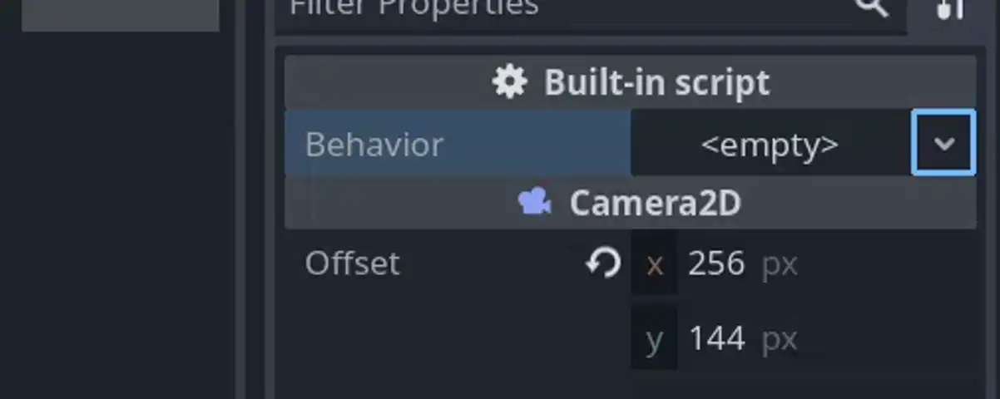

# net.bobbo.instantiable

A Godot plugin made for BOBBO-NET's netengine5 framework.
This plugin provides Instantiables - a resource-type that acts as an interface for instantiable types.

## Dependencies

This plugin is made for Godot 4.1.

## Usage

### Using an `Instantiable`

In a script where you want to instantiate something, instead of `@export`ing a PackedScene or Script property, export an Instantiable instead.

```
@export var behaviour: Instantiable
```

Now, in the inspector, you can create a new instantiable and choose the type of source you want to use, and then assign either a script or packed scene.


### Making `Instantiable` Type-Safe

At the moment, `Instantiable` doesn't support nice type-safety for quick-selecting values - but it does support type validation.

When extending `Instantiable`, you can extend the following functions in order to provide type validation:

- `_is_script_valid(script: Script) -> bool`
- `_is_packed_scene_valid(packed_scene: PackedScene) -> bool`
