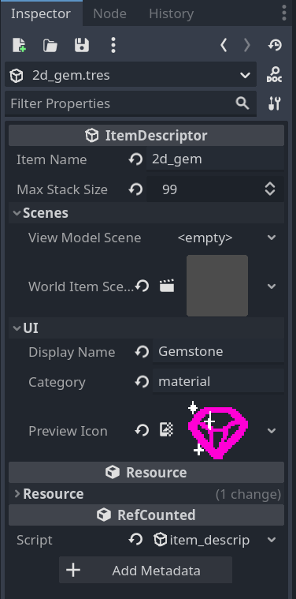

# net.bobbo.item

A Godot plugin made for BOBBO-NET's netengine5 framework.
This plugin provides support for usable items and inventories.

## Dependencies

This plugin is made for Godot 4.1.

## Usage

### Creating a new item with `ItemDescriptor`

All items come from some source `ItemDescriptor`. This describes high-level properties about an item and how to construct it. A descriptor then acts as a factory for creating that kind of item. `ItemDescriptor`s hold data like:

- An item's name
- How many of this item can be held in a single stack
- An item's view model scene
- The scene to spawn when the item is in the world
- Properties to help display the item in a UI

New `ItemDescriptor`s can be created using Godot's New Resource menu. Once created, fill in the properties as follows:

#### Item Name

This is the internal name for the item. It may be used to identify the item in code. Should follow snake-case conventions.

#### Max Stack Size

How many of this item can be fit in a stack. Typically a max stack size is 1 for items with unique data like weapons, batteries, complex keys, etc. For some collectable or material, a max stack size may be higher (something like 99 or 64).

#### View Model Scene

The scene to instantiate when this item is being held by the local player. It's root node should extend from `WorldItem2D` or `WorldItem3D`.

#### Display Name

The external name to display to the player in some UI, for this item. If this is empty, then the item name will be used instead.

#### Category

A completely optional string that categorizes this item in some way. This is primarily for the UI displaying this item to potentially show it differently.

#### Preview Icon

An icon used to represent this item when it is represented by a 2D UI.
